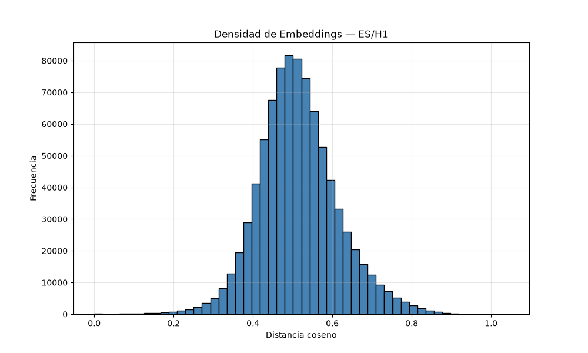
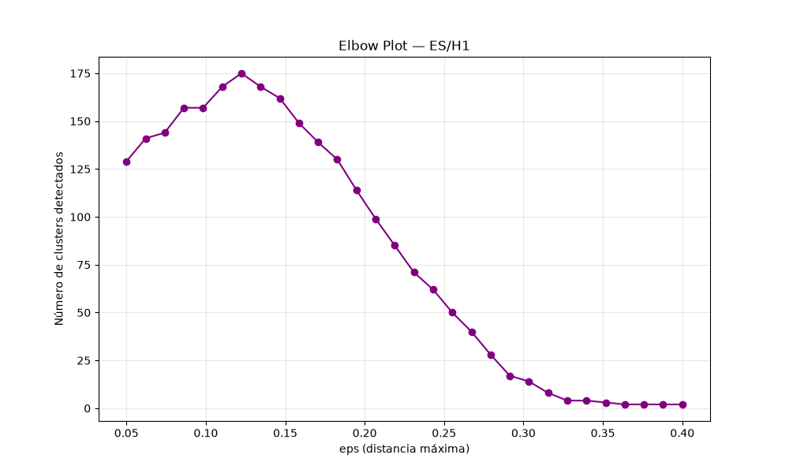

# Reporte de Embeddings — ES/H1

## 1. Histograma de densidad

### Estadísticas
- **min**: 0.0000
- **max**: 1.0440
- **mean**: 0.5133
- **median**: 0.5069
- **p10**: 0.3971
- **p90**: 0.6427

---

## 2. Gráfica del codo (Elbow)

## 3. Comparación de métodos de codo

| Método | EPS detectado | Interpretación |
|--------|---------------|----------------|
| Matemático | 0.183 | Mayor caída en clusters |
| Kneedle | 0.122 | Codo visual real |
| Máxima curvatura | 0.122 | Punto donde la curva se dobla más |

### Valores probados
- eps=0.050 → clusters=129
- eps=0.062 → clusters=141
- eps=0.074 → clusters=144
- eps=0.086 → clusters=157
- eps=0.098 → clusters=157
- eps=0.110 → clusters=168
- eps=0.122 → clusters=175
- eps=0.134 → clusters=168
- eps=0.147 → clusters=162
- eps=0.159 → clusters=149
- eps=0.171 → clusters=139
- eps=0.183 → clusters=130
- eps=0.195 → clusters=114
- eps=0.207 → clusters=99
- eps=0.219 → clusters=85
- eps=0.231 → clusters=71
- eps=0.243 → clusters=62
- eps=0.255 → clusters=50
- eps=0.267 → clusters=40
- eps=0.279 → clusters=28
- eps=0.291 → clusters=17
- eps=0.303 → clusters=14
- eps=0.316 → clusters=8
- eps=0.328 → clusters=4
- eps=0.340 → clusters=4
- eps=0.352 → clusters=3
- eps=0.364 → clusters=2
- eps=0.376 → clusters=2
- eps=0.388 → clusters=2
- eps=0.400 → clusters=2
